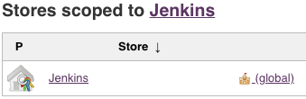
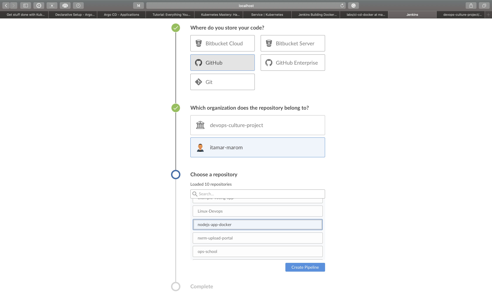
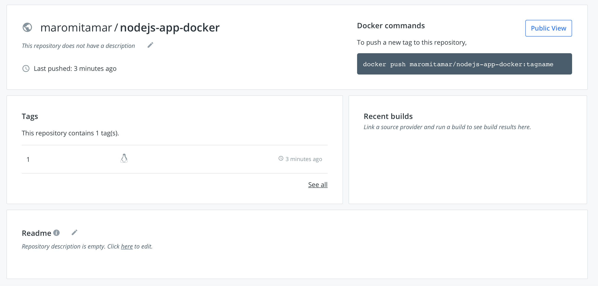

# CI/CD for Docker
In this lab we will create an entire environment of developement.
We will create a basic ci/cd for docker that will build the image and push it to your docker hub account.

## Requirements
This lab assumes that you are running on a linux machine.
Please install theese softwares on your machine/workstation:
* docker 
* docker-compose

## Environment
This is your working directory for this lab (Labs/ci-cd-docker).

## GitHub
Please create a GitHub account at: https://github.com/  
Fork this repository to your account.  
Please fork another repository from this project: "https://github.com/devops-culture-project/nodejs-app-docker"

## Docker Hub
Please create a docker hub account at: https://hub.docker.com/

### Docker Hub Repository
Create a docker repository named "nodejs-app-docker".  
NOTE: Don't touch the build settings. (Docker can create automated builds to your image by itself)

## Jenkins
Attached there is a Dockerfile. It will be your jenkins (also docker installed inside)
Run this command:  
    `docker build . -t devops-culture/jenkins-docker:1`  

Ensure that the docker image created:  
    `docker image ls`  

In your machine - please create the following directory:  
    `mkdir /tmp/jenkins_home`  
* IMPORTANT: This is your jenkins data so if you preffer to save it somewhere else please edit the docker-compose too.

Attached there is a docker-compose.yml file. It will set up your Jenkins server.  
On your own:
* Look at the compose file and see whats inside.
* Find the address that jenkins will listen to.  

run in the working directory:  
    `docker-compose up -d`  
View the generated administrator password to log in the first time:  
    `docker exec jenkins-docker cat /var/jenkins_home/secrets/initialAdminPassword`  
Enter jenkins and log in.

Enter the password and continue.  
In next screen, click “Install suggested plugins” and wait for them to install.  
In the next section you need to create a user for yourself.

Click "get start using Jenkins"  
Now we need to install two plugins:
* blueocean plugin to beautify your jenkins. This plugin better the usability of jenkins and focus in pipelines scripts.
* locale plugin to jenkins always show english text. You don’t need install this, but i suggest install to search errors directly in english.

Go to Plugin Manager again and search for locale.

To install plugins:
- In home of jenkins, click in Manage Jenkins:

- Click manage plugins:

In Plugin manager, you need click in Available tab and after load the tab, search the plugins:

Search for locale, mark the checkbox and click in install button:

After install locale, go to Home > Manage Jenkins > Configure System.

Search for locale. Input “en” in “Default language” and check “ignore browser preference and force this language to all users”:

Locale Plugin installed and configured, lets install Blue ocean.  
Back to jenkins home > Manage jenkins >Manage Plugins. In Available tab search for blueocean and install it.

All done. But you see the visual without blue ocean plugin, let’s use it.  
In Jenkins home, Click in “Open Blue Ocean” (left menu):

Now, you will see a screen like this:

All Right, now we have jenkins installed and we are using blue ocean plugin to have a better experience in your pipelines.

### Docker Hub Credential
Go to jenkins home, click on "Manage Jenkins" and “Manage Credentials”, finaly, click "global".

Click on “Add Credentials” in left menu, put your credential and save it.

* IMPORTANT: If you didn't called your credential 'dockerhub' you should change it also in the Jenkinsfile.

Great!  
The next step is to create a pipeline to build some things for us.

## Jenkinsfile
Attached is a Jenkinsfile for this lab, please read the explanation inside this file.  
* IMPORTANT: For this to work, in the Jenkinsfile, please replace the docker_hub_account with your account.

## Creating a job to test docker command
Go back to the blue ocean view.
Click on "Create new pipeline"
Fill the form:
* Choose GitHub
* Give an access token which you can create via the "create access token" link
* Choose user user
* Choose the nodejs-app-docker repository
Click "Create pipeline"

## Building the first docker image 
After saving this pipeline, Jenkins will start running it's first run.
It suppose to succeed:

You can go to your docker hub repository and look at the image pushed:

Now pull the image from your docker repository:  
    `docker pull docker_account/nodejs-app-docker:1`  
Run the docker app:  
    `docker run -p 3000:3000 docker_account/nodejs-app-docker:1 nodejs-app`

### Clean your lab
1. From the working directory, stop the compose:  
    `docker-compose down -v`
1. In case you don't want to save your jenkins data, remove /tmp/jenkins_home from your machine:  
    `rm -rf /tmp/jenkins_home`

## Biblography
This Lab is based on these tutorials:  
* https://medium.com/@gustavo.guss/quick-tutorial-of-jenkins-b99d5f5889f2
* https://medium.com/@gustavo.guss/jenkins-building-docker-image-and-sending-to-registry-64b84ea45ee9
