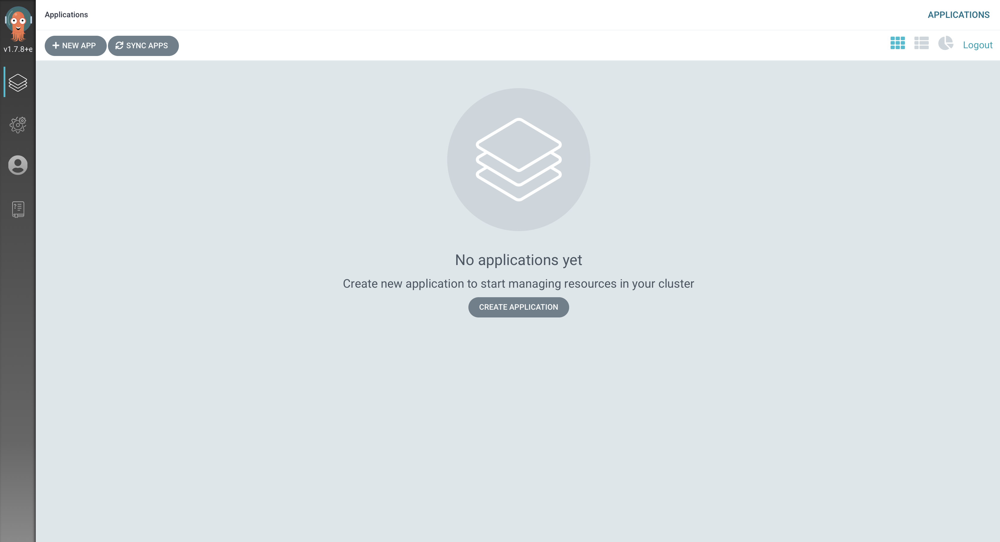
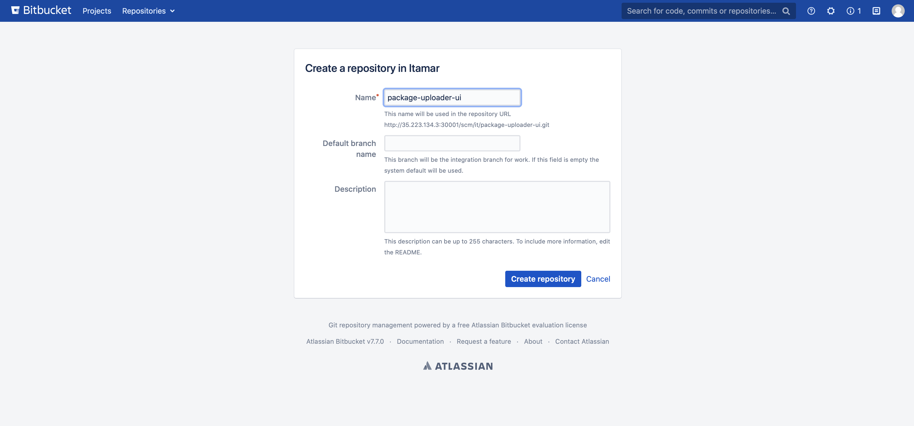
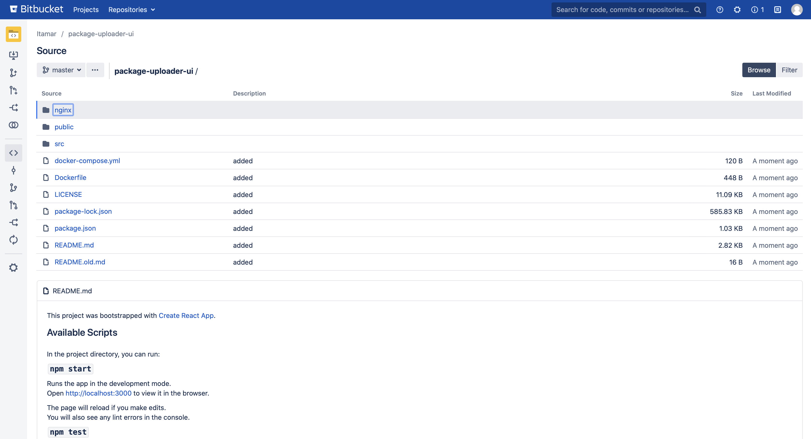
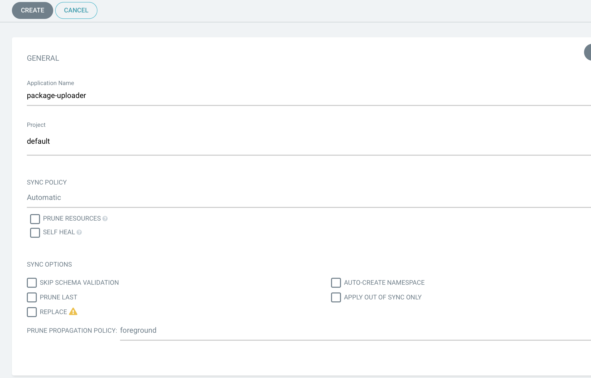
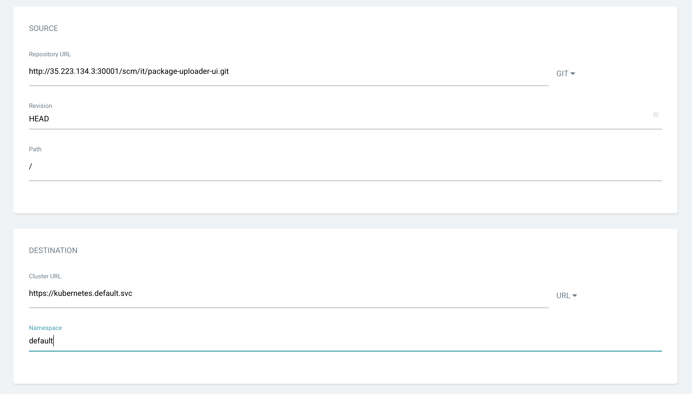

# CD the Gitops way to k8s
In this lab we will need a local git and argocd (and of course k8s installed)
we will create a basic deployment of an application and then will connect it to argocd and see the changes we can do.

## Requirements
Recommendation: This lab is taking a lot of resources from your computer, so it's prefered to run it on a cloud.
This lab assumes that you are running on a linux machine.
Please install theese softwares on your machine/workstation:
* Docker
* Kubernetes

## Environment
This is your working directory for this lab (Labs/gitops-cd-k8s).  
Don't forget to clone this repository !

## Bitbucket
Run on your machine: `kubectl apply -f deploy/bitbucket/`  
With that command, you deployed a bitbucket instance to your environment:
* Bitbucket server (StatefulSet)
* Bitbucket volume (PV)
* Bitbucket service (Service of type NodePort)

Run: `kubectl get svc bitbucket-svc -o json | jq .spec.ports[0].nodePort`  
This will show you your port for outside-cluster communication!  
> kubectl get svc bitbucket-svc -o json | jq .spec.ports[0].nodePort  
> 30001  

If you are Running on cloud, you want to know a cluster node IP.
Run: `kubectl get nodes -o json | jq .items[0].status.addresses[1]`  
> kubectl get nodes -o json | jq .items[0].status.addresses[1]  
> {  
>   "address": "35.223.134.3",  
>   "type": "ExternalIP"  
>}  

Make sure it's type is ExternalIP.  
Also and very important, the cloud is by default have no ports open in it's firewall, so we have to open our services port.  
For GCP run: `gcloud compute firewall-rules create bitbucket-web-port --allow tcp:<YourNodePort>`
> gcloud compute firewall-rules create bitbucket-web-port --allow tcp:30001

Go on your browser to: http://localhost:<YourNodePort>/setup (or for cloud: http://<ClusterNodeIP:<YourNodePort>/setup)  
You can also test your api respose:  
> curl -X GET "http://localhost:30001/setup"

You should see the bitbucket's setup page.  Do the quick setup with the internal DB and no jira integration.  
It shoukd ask you for a license, you can generate it easily (just choose server license when you'll need to).  
Log in to bitbucket and that should be enough for it.

## ArgoCD
Go to: https://raw.githubusercontent.com/argoproj/argo-cd/stable/manifests/install.yaml  
You should see a manifest of the argocd installation.  
Run on your local machine: `wget -O deploy/argocd/install-argocd.yaml https://raw.githubusercontent.com/argoproj/argo-cd/stable/manifests/install.yaml`
* warning: You should NEVER run a yaml from the web right into your system (It can be a virus...), so first download it and see what's inside.  

Create a namespace for argocd to run in: `kubectl create namespace argocd`
Run on your local machine: `kubectl apply -n argocd -f deploy/argocd/install-argocd.yaml`  
By default, the Argo CD API server is not exposed with an external IP. To access the API server:  
If you running locally we'll use Port forwarding.  
Run: `kubectl port-forward svc/argocd-server -n argocd 8080:443`  
If you running on cloud patch the svc to become a LoadBalancer:  
Run: `kubectl patch svc argocd-server -n argocd -p '{"spec": {"type": "LoadBalancer"}}'`  
and look for the externalIP with the command: `kubectl get svc -n argocd`  
> kubectl get svc -n argocd  
> ...  
> argocd-server           LoadBalancer   <InternalIP>    <ExternalIP>   80:31253/TCP,443:30053/TCP   5m55s  

You can now go to: "http://localhost/" or "http://<LoadBalancerIP>/" and see the ArgoCD UI.

To get the password of the admin user, run: 
`kubectl get pods -n argocd -l app.kubernetes.io/name=argocd-server -o name | cut -d'/' -f 2`  
> kubectl get pods -n argocd -l app.kubernetes.io/name=argocd-server -o name | cut -d'/' -f 2  
> argocd-server-bdcdd6f7c-l8hw4  

Go to the UI and enter username and password.

Great ! we finished setting up our environment!  
We we'll now use our environment to do a CD to our kubernetes cluster with an app and our ArgoCD.  
Please clone this repository: `git clone https://github.com/devops-culture-project/nexus-uploader-dashboard-example.git`  

In Bitbucket, Create a project with your name and a repository called "package-uploader-ui":

Clone the repository to your environment (Not inside labs directory!)
> git clone http://<bitbucket>/scm/it/package-uploader-ui.git  
> warning: You appear to have cloned an empty repository.  

Go to the first clone we made from github and delete the '.git' hidden directory:  
`rm -rf nexus-uploader-dashboard-example/.git`  
After deletion is complete, copy the files into our new bitbucket clone:  
`cp -r nexus-uploader-dashboard-example/* package-uploader-ui/`  
And then push the code into bitbucket (Do it yourself). Bitbucket may ask you to config user.email and user.name - do it.

We can see that the repository has a deploy folder. Look inside and see how the application deploys itself to k8s.  
Look at the spec of the deployment yaml, you'll see there the image of our application.  
> spec:  
>   containers:  
>     - image: DOCKERHUBUSER/pkgup-ui:1  
>       name: pkgup-ui  

What about to app's docker image ? well... we'll have to build it:  
`docker build . -t DOCKERHUBUSER/pkgup-ui:1`  
And then push it to your docker hub repo:  
`docker push DOCKERHUBUSER/pkgup-ui:1`  
Check you have that image in your docker hub.

The next thing we'll do is to add our project to ArgoCD. Go the argo and push on the button "+ NEW APP".  
Give your app the name, under project fill 'default' and leave sync policy in manual mode.

Under source, fill the bitbucket repo url, keep HEAD as the revision and unde path put '/'.  
Under Cluster URL fill: https://kubernetes.default.svc  
Under Namespace choose the default.  

Click "+CREATE"  

<< TODO: Create is not working >>

### Clean your lab
1. From the working directory, stop the compose:  
    `docker-compose down -v`
1. In case you don't want to save your jenkins data, remove /tmp/jenkins_home from your machine:  
    `rm -rf /tmp/jenkins_home`  
1. Clear ddclient config:
    `rm -rf /tmp/ddclient-config`

## Biblography
This Lab is based on these tutorials:  
* https://argoproj.github.io/argo-cd/getting_started/