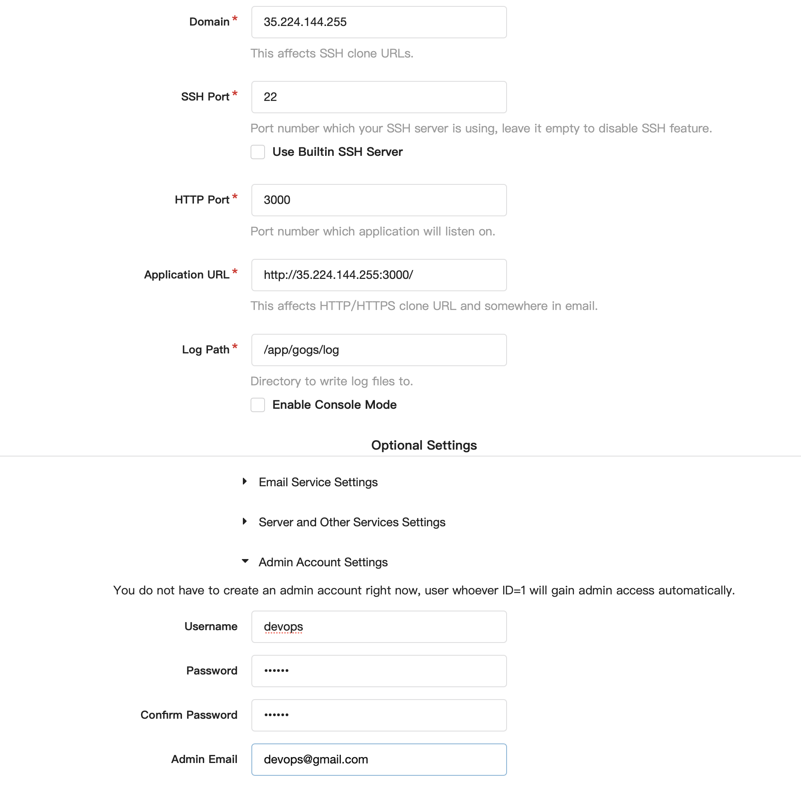
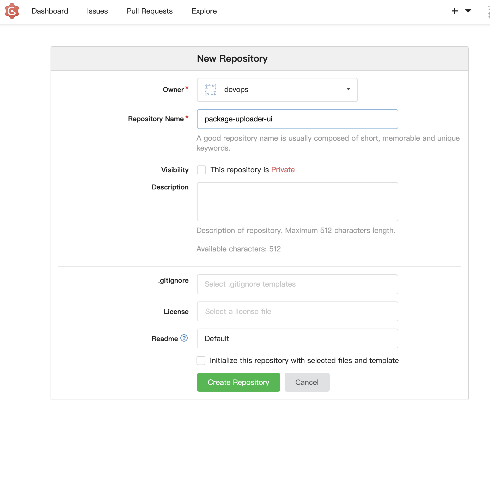
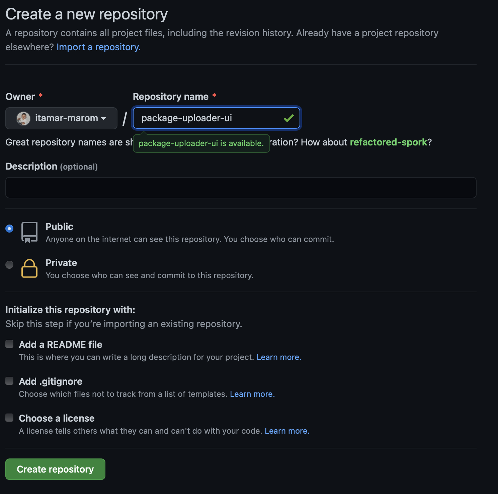
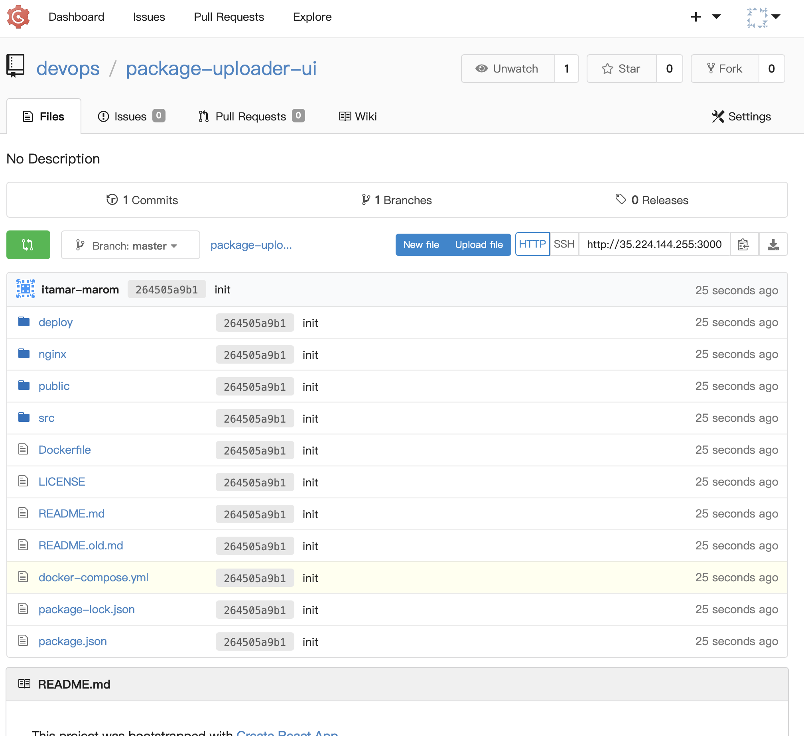
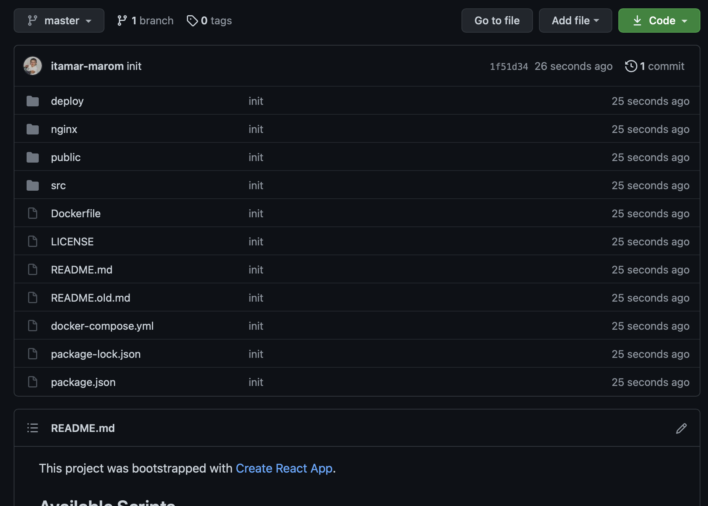
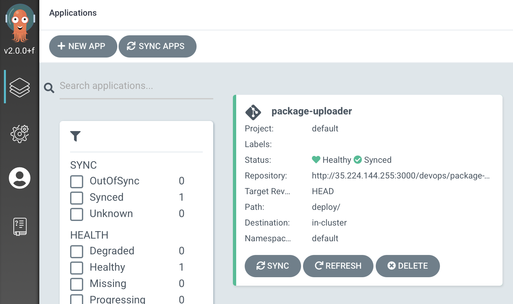
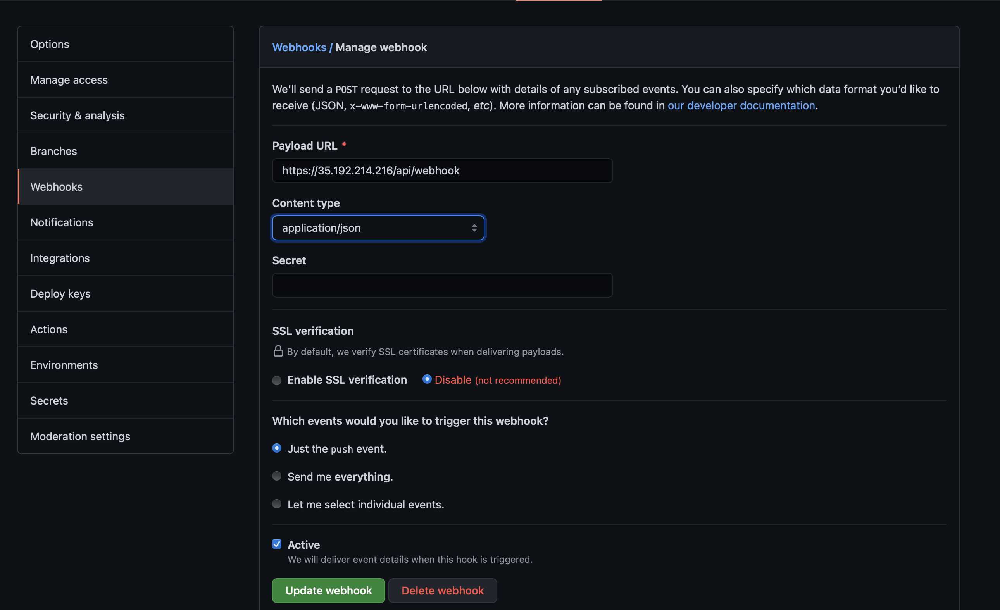
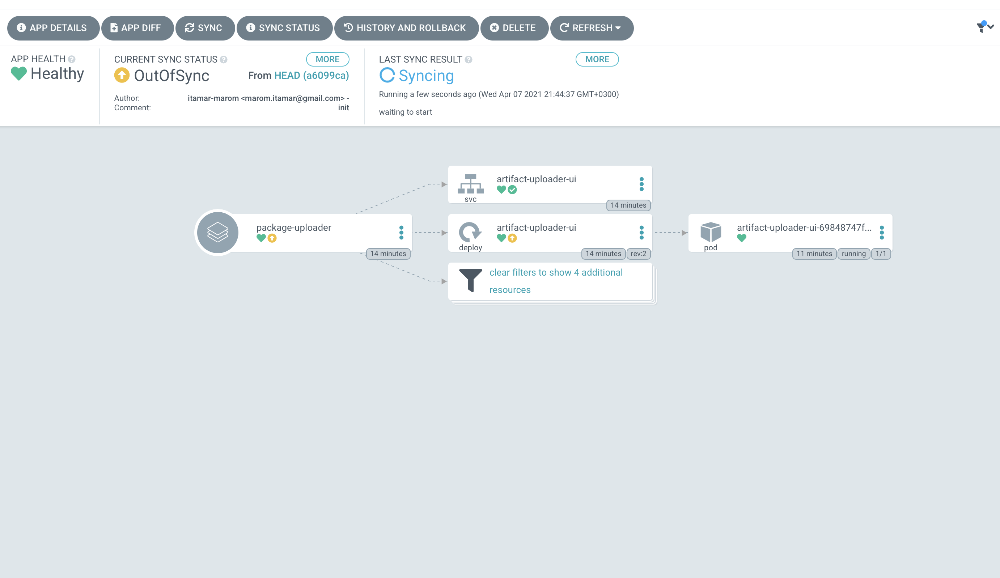
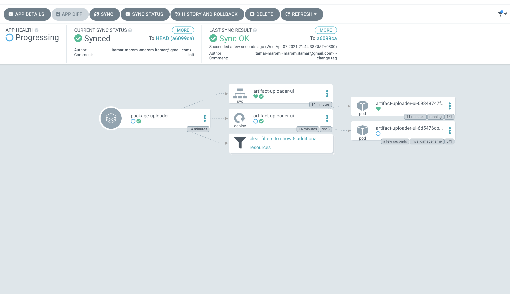

# CD the Gitops way to k8s
In this lab we will need a local git and argocd (and of course k8s installed)
we will create a basic deployment of an application and then will connect it to argocd and see the changes we can do.

## Requirements
Recommendation: This lab should be running on cloud.
This lab assumes that you are running on a linux machine.
Please install theese softwares on your machine/workstation:
* Kubernetes
* Docker
Note: normally when installing kubernetes docker is inside. But still make sure it is installed.

## Environment
This is your working directory for this lab (Labs/gitops-cd-k8s).  
Don't forget to clone this repository!

<!-- ## Gogs
Run on your machine: `kubectl apply -f deploy/gogs/`  
With that command, you deployed a gogs instance to your environment:
* gogs namespace
* gogs server (StatefulSet)
* gogs volume and claim (PVC)
* gogs service (Service of type LoadBalancer)

Run: `kubectl get svc gogs-server -n gogs -o json | jq .status.loadBalancer.ingress[0].ip`  
This will show you your ip for outside-cluster communication!  
> kubectl get svc gogs-server -n gogs -o json | jq .status.loadBalancer.ingress[0].ip  
> "35.224.144.255"

Go on your browser to: http://<YourLoabBalancerIp>:3000
You can also test your api respose:  
> curl -X GET "http://35.224.144.255:3000"

You should see the gogs's setup page. Do the quick setup:
- SQLite DB
- under 'domain' put your LB IP
- under 'application url' replace localhost with your LB IP
- under 'Optional Settings' tab, click on 'Admin Acount Settings' and create an admin user

Click on 'Install Gogs'. -->

## ArgoCD
Go to: https://raw.githubusercontent.com/argoproj/argo-cd/stable/manifests/install.yaml  
You should see a manifest of the argocd installation.  
Run on your local machine:  
`wget -O deploy/argocd/install-argocd.yaml https://raw.githubusercontent.com/argoproj/argo-cd/stable/manifests/install.yaml`
* warning: You should NEVER run a yaml from the web right into your system (It can be a virus...), so first download it and see what's inside.  

Create a namespace for argocd to run in: `kubectl create namespace argocd`
Run on your local machine: `kubectl apply -n argocd -f deploy/argocd/install-argocd.yaml`  
By default, the Argo CD API server is not exposed with an external IP. To access the API server:  
If you running locally we'll use Port forwarding.  
Run: `kubectl port-forward svc/argocd-server -n argocd 8080:443`  
If you running on cloud patch the svc to become a LoadBalancer:  
Run: `kubectl patch svc argocd-server -n argocd -p '{"spec": {"type": "LoadBalancer"}}'`  
and look for the externalIP with the command: `kubectl get svc -n argocd`  
> kubectl get svc -n argocd  
> ...  
> argocd-server           LoadBalancer   <InternalIP>    <ExternalIP>   80:31253/TCP,443:30053/TCP 

You can now go to: "http://localhost/" or "http://<LoadBalancerIP>/" and see the ArgoCD UI.

To get the password of the admin user, run:  
`kubectl -n argocd get secret argocd-initial-admin-secret -o jsonpath="{.data.password}" | base64 -d`  
> kubectl -n argocd get secret argocd-initial-admin-secret -o jsonpath="{.data.password}" | base64 -d  
> EiGtNMdNPkIKFVVq 

Go to the UI and enter username and password.

Great ! we finished setting up our environment!  
We we'll now use our environment to do a CD to our kubernetes cluster with an app and our ArgoCD.  
Please clone this repository:  
`git clone https://github.com/devops-culture-project/nexus-uploader-dashboard-example.git`  

<!-- In Gogs, Create a repository called "package-uploader-ui":

Clone the repository to your environment (Not inside labs directory!)
> git clone http://<gogs>:3000/devops/package-uploader-ui.git  
> warning: You appear to have cloned an empty repository.   -->

In github, Create a repository called "package-uploader-ui"  

Clone the repository to your environment (Not inside labs directory!)
> git clone http://github.com/USERNAME/package-uploader-ui.git  
> warning: You appear to have cloned an empty repository.   

<!-- Go to the first clone we made from github and delete the '.git' hidden directory:  
`rm -rf nexus-uploader-dashboard-example/.git`  
After deletion is complete, copy the files into our new gogs clone:  
`cp -r nexus-uploader-dashboard-example/* package-uploader-ui/`  
And then push the code into gogs (Do it yourself). Gogs may ask you to config user.email and user.name - do it.

 -->

Go to the first clone we made from github and delete the '.git' hidden directory:  
`rm -rf nexus-uploader-dashboard-example/.git`  
After deletion is complete, copy the files into our new repository clone:  
`cp -r nexus-uploader-dashboard-example/* package-uploader-ui/`  
And then push the code into github (Do it yourself). Github may ask you to config user.email and user.name - do it.

 -->

We can see that the repository has a deploy folder. Look inside and see how the application deploys itself to k8s.  
Look at the spec of the deployment yaml, you'll see there the image of our application.  
> spec:  
>   containers:  
>     - image: DOCKERHUBUSER/pkgup-ui:1  
>       name: pkgup-ui  

If you don't have a dockerhub account this is the time - create one!  
If you already did (as I asked), change the image name to your dockerhub user and push it.

What about to app's docker image ? well... we'll have to build it:  
`docker build . -t DOCKERHUBUSER/pkgup-ui:1`  
And then push it to your docker hub repo:  
`docker push DOCKERHUBUSER/pkgup-ui:1`  
Check you have that image in your docker hub.

The next thing we'll do is to add our project to ArgoCD. Go the argo and push on the button "+ NEW APP".  
Give your app the name, under project fill 'default' and change sync policy in automatic mode.

Under source, fill the repository repo url, keep HEAD as the revision and under path put 'deploy/'.  
Under Cluster URL fill: https://kubernetes.default.svc  
Under Namespace choose the default.  

Click "+CREATE"  

After a few second, you should see this in your screen:

Click on your app, you should see your entie deployment in a healthy state.

Run in your console:  
`k get svc`  
You should see the external ip of your new app. Go to http://<external-ip> and see the app!
Run `k get deploy artifact-uploader-ui -o json | jq .spec.template.spec.containers[0].image`  
You should get the image name used by the current deployment.

### Argo - Github webhook
We want argo to know when there is a change, for that we'll have to configure webhook from github to argo.  
In your github package uploader repository go to settings -> webhooks -> click on 'add webhook'
Under 'payload url': https://<argo-ip>/api/webhook  
Content Type should be: 'application/json'  
Disable the SSL verification (yes, I know it's bad)  
It should look like this:

Now, let's check this webhook. Let's tag our app image with a new tag and push it to the registry.  
Run: `docker tag DOCKERHUBUSER/pkgup-ui:1 DOCKERHUBUSER/pkgup-ui:2`  
And then: `docker push maromitamar/pkgup-ui:2`  
Now, edit the application's deployment by switching the image tag to the new one.  
It should look like this:  
> spec:  
>   containers:  
>     - image: DOCKERHUBUSER/pkgup-ui:2  
>       name: pkgup-ui  

Commit your change and push it to github. After that, go faster to the app window in argo and see whats happening:  

 

Argo noticed that what is written in the git repo and what si running in our k8s cluster is different, and because it is a gitops tool,
our git is our only source of thruth, so he changed what's in the cluster to fit whats in the git.

Let's do another thing.  
We will delete our application pod from the k8s cluster itself. Argo then should notice the same thing as before - 
what is written in the git repo and what si running in our k8s cluster is different - so he will check the git and as the git says,
he will create our deployment again.  
Run: `kubectl delete deployment artifact-uploader-ui`  

Wait what ? Argo went out-of-sync but it isn't creating my deployment back!  
That's because it isn't in his sync policy!  
Go to 'App details' -> 'sync policy' -> press 'enable' next to self heal  
And.. there you go! argo is creating our deployment.  
You can try and delete the deployment again, but now Argo will create it automatically.

Hope you enjoyed and even learned something, Gitops is a great concept and you should think about implementing it in every thing you do.  
We still left to clean our mess...
### Clean your lab
1. From the lab's working directory, delete all deployments:  
    `kubectl delete -f deploy/argocd/`
    `kubectl delete ns argocd`
1. From the app's working directory, delete all deployments:  
    `kubectl delete -f deploy/`  
1. Remove all folders of lab and app
1. Remove your github repo if you don't want it
* Important: It's funny but don't delete your app and then Argo, because argo of course will make sure to create it again.

## Biblography
This Lab is based on these tutorials:  
* https://argoproj.github.io/argo-cd/getting_started/